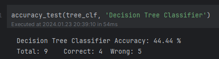
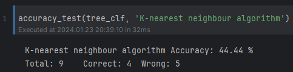
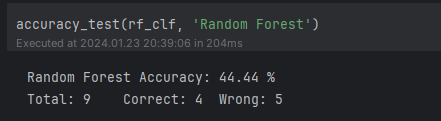

# Women Empowerment Classification
A jupyter project to analyse the accuracy of different machine learning algorithms on Women empowerment dataset
this projects demonstrates how to process csv file and train models based on these classifiers
  - Gaussian Naive Bayes Classifier
  - Random Forest Classifier
  - Support Vector Machine Classifier
  - Decision Tree Classifier
  - K-nearest neighbour Classifier

# Installation
- run `pip install -r requirements.txt`
- run jupyter notebook file `main.ipynb`
- It will show the accuracy of different Machine Learning algorithms

# Preview

